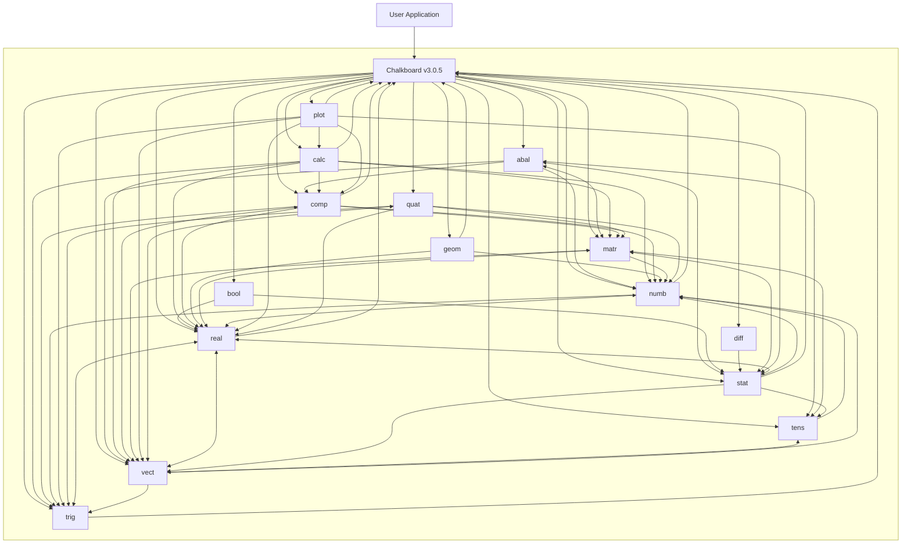

# Chalkboard Architecture

Latest commit: Monday, September 7, 2026, [**`current`**](https://github.com/Zushah/Chalkboard/commit/HEAD).

Previous commit: Friday, September 4, 2026, [**`4799dcc`**](https://github.com/Zushah/Chalkboard/commit/4799dcc).

Latest release: Monday, September 7, 2026, [**`v3.0.5`**](https://github.com/Zushah/Chalkboard/releases/tag/v3.0.5).

## Contents

- [1. Architecture](#1-architecture)
  - [1.1. Architecture diagram](#11-architecture-diagram)
  - [1.2. Shared namespace and public API](#12-shared-namespace-and-public-api)
  - [1.3. Public mathematical representations](#13-public-mathematical-representations)
  - [1.4. Root operations and shared configuration](#14-root-operations-and-shared-configuration)
  - [1.5. Composition and dependency direction](#15-composition-and-dependency-direction)
  - [1.6. abal](#16-abal)
  - [1.7. bool](#17-bool)
  - [1.8. calc](#18-calc)
  - [1.9. comp](#19-comp)
  - [1.10. diff](#110-diff)
  - [1.11. geom](#111-geom)
  - [1.12. matr](#112-matr)
  - [1.13. numb](#113-numb)
  - [1.14. plot](#114-plot)
  - [1.15. quat](#115-quat)
  - [1.16. real](#116-real)
  - [1.17. stat](#117-stat)
  - [1.18. tens](#118-tens)
  - [1.19. trig](#119-trig)
  - [1.20. vect](#120-vect)
  - [1.21. Runtime consumption](#121-runtime-consumption)
  - [1.22. Architectural invariants and limits](#122-architectural-invariants-and-limits)
- [2. Codebase](#2-codebase)
  - [2.1. Mathematical source ownership](#21-mathematical-source-ownership)
  - [2.2. Public API tests](#22-public-api-tests)
  - [2.3. Executable examples](#23-executable-examples)
  - [2.4. Distribution assembly and declarations](#24-distribution-assembly-and-declarations)
  - [2.5. Documentation generation and deployment](#25-documentation-generation-and-deployment)
  - [2.6. Assets, paper, and repository policy](#26-assets-paper-and-repository-policy)
- [3. Guidelines](#3-guidelines)
  - [3.1. Establish the local change boundary](#31-establish-the-local-change-boundary)
  - [3.2. Change public APIs and namespaces coherently](#32-change-public-apis-and-namespaces-coherently)
  - [3.3. Preserve representation and metadata contracts](#33-preserve-representation-and-metadata-contracts)
  - [3.4. Review cross-namespace dependencies](#34-review-cross-namespace-dependencies)
  - [3.5. Change parsers and symbolic rules](#35-change-parsers-and-symbolic-rules)
  - [3.6. Validate numerical algorithms](#36-validate-numerical-algorithms)
  - [3.7. Specify vector, matrix, and tensor behavior](#37-specify-vector-matrix-and-tensor-behavior)
  - [3.8. Preserve plotting and host behavior](#38-preserve-plotting-and-host-behavior)
  - [3.9. Maintain examples and documentation](#39-maintain-examples-and-documentation)
  - [3.10. Handle generated and release artifacts](#310-handle-generated-and-release-artifacts)
  - [3.11. Run relevant validation](#311-run-relevant-validation)
  - [3.12. Update this architecture reference](#312-update-this-architecture-reference)

## 1. Architecture

### 1.1. Architecture diagram



The application enters through the shared `Chalkboard` API, which exposes all fifteen namespaces. The subgraph encloses the library, leaving the user application outside. The `Chalkboard v3.0.5` node also represents root members such as `APPLY`, `REGISTRY`, `PI`, `E`, and `CONTEXT`. It has one outward arrow to each namespace, and inward arrows represent namespace dependencies on root members. Between namespace nodes, an arrow points from the calling namespace to the namespace it uses, and bidirectional arrows indicate calls in both directions. These are possible runtime dependencies visible in the source, not a fixed execution sequence. Application-mediated data transfers are separate, for example, an application can pass a solved ODE to `plot` without `plot` calling `diff`.

### 1.2. Shared namespace and public API

`./src/Chalkboard.ts` establishes the root `Chalkboard` namespace and the public type vocabulary. Fifteen companion files extend it with `abal`, `bool`, `calc`, `comp`, `diff`, `geom`, `matr`, `numb`, `plot`, `quat`, `real`, `stat`, `tens`, `trig`, and `vect`. The normal access pattern is `Chalkboard.<namespace>.<operation>`.

The source files are TypeScript namespace scripts. They share declarations without importing each other. A mathematical namespace is an organizational boundary, not an independently loaded package or an isolated runtime service. Public exports include constructors, arithmetic, predicates, conversions, algorithms, parsers, and drawing operations. Constructors generally return ordinary objects or arrays; there is no common mathematical base class, object registry, or method-dispatch hierarchy.

Chalkboard is a mathematical environment in the sense that an application can construct a model, calculate with it, inspect symbolic expressions, sample results, and draw them using shared representations. The application still owns execution order, iteration, animation, persistence, and user interaction. The library has no worksheet evaluator or reactive dependency scheduler.

### 1.3. Public mathematical representations

The eleven aliases in `./src/Chalkboard.ts` are top-level type names, such as `ChalkboardComplex`, rather than members such as `Chalkboard.Complex`.

| Type | Runtime representation | Meaning used by consumers |
| --- | --- | --- |
| `ChalkboardComplex` | `{ a, b }` | Real and imaginary components of `a + bi`. |
| `ChalkboardQuaternion` | `{ a, b, c, d }` | Scalar component first, followed by the three imaginary components. |
| `ChalkboardVector` | `{ x, y, z?, w? }`, numeric array, `Float32Array`, `Float64Array`, matrix, or string | A two-, three-, or four-component vector at APIs that normalize the union. |
| `ChalkboardMatrix` | `number[][]` | Dense real entries indexed by row, then column. |
| `ChalkboardTensor` | `number` or recursively nested tensor arrays | Scalar leaves and array-defined axes; a scalar has rank zero. |
| `ChalkboardFunction` | `{ rule, field, type }` | One numeric callback or component callbacks, tagged by field and geometric function category. |
| `ChalkboardSet<T>` | `{ contains, elements?, id? }` | Membership predicate, optional finite enumeration, optional recognized set identifier. |
| `ChalkboardStructure<T>` | `{ set, operation?, identity?, inverter?, add?, mul?, addIdentity?, mulIdentity?, addInverter?, mulInverter? }` | A carrier set with optional group-like or ring-like operations, identities, and inverses. |
| `ChalkboardMorphism<T, U>` | `{ struc1, struc2, mapping }` | Explicit domain and codomain structures plus a mapping callback. |
| `ChalkboardStructureExtension<T, U>` | `{ base, extension, degree, basis, isFinite, isSimple, isAlgebraic }` | Extension metadata; `basis` is an array of `ChalkboardVector` values. |
| `ChalkboardODE` | `{ rule, order, dimension, type }` | A canonical first-order state system, retaining the input equation's order and category. |

These shapes are transparent but not uniformly serializable: functions, sets, structures, morphisms, and ODEs contain callbacks. JSON output from a parser describes expression data; it is not a serializer for all mathematical objects.

Shapes also overlap. A matrix is structurally a tensor and can represent a row or column vector. Consumers determine meaning from the called operation, metadata, or runtime shape checks. There is no universal tagged-value layer that resolves every overlap. TypeScript aliases do not enforce rectangular matrices, uniform tensor shapes, algebraic laws, or valid function arities at runtime.

### 1.4. Root operations and shared configuration

`./src/Chalkboard.ts` exports nine root members:

| Member | Contract |
| --- | --- |
| `APPLY(object, callback)` | Dispatches on runtime shape and applies a callback to scalar components or enumerated set elements. |
| `CONTEXT` | Mutable string expression used to resolve a default drawing context; initially `"ctx"` when `window` exists and `"0"` otherwise. |
| `E(exponent = 1)` | Computes an approximation to the exponential using range reduction and a polynomial. |
| `I(exponent = 1)` | Returns an integer power of the imaginary unit as a complex object, using the exponent modulo four. |
| `PI(coefficient = 1)` | Computes a Gauss–Legendre approximation to pi and multiplies it by the coefficient. |
| `REGISTER(name, func)` | Adds or replaces a numeric callback in `REGISTRY`. |
| `REGISTRY` | Mutable object of named numeric callbacks consulted by expression parsers. |
| `VERSION` | Current literal `"3.0.5"`. |
| `VERSIONALIAS` | Current literal `"Euler"`. |

`APPLY` handles complex and quaternion components, object-form vectors, arrays interpreted as matrices or recursive tensors, scalars, and finite sets or structures. Applying it to a finite set or structure returns an array of mapped elements; it does not reconstruct operations or a membership predicate. An unenumerated set cannot be mapped this way. Its shape dispatcher does not implement every input coercion accepted by `vect`, including typed-array and string vector inputs.

Configuration is shared across callers of the same namespace object. `vect.modeConfig` and `bool.modeConfig` retain their own mutable output modes. `CONTEXT` and `REGISTRY` are directly visible mutable state. There is no per-consumer configuration object that isolates these choices automatically.

### 1.5. Composition and dependency direction

The strongest boundaries are representation contracts rather than a strict hierarchy of imports. The main composition paths are:

- `calc` evaluates `real` and `comp` function records and uses `vect` and `matr` to represent geometric derivatives and Jacobians.
- `diff` uses numeric state arrays and sequence arithmetic from `stat`. It does not obtain its ODE derivatives by calling `calc`.
- `stat.regression` uses matrix operations and returns a real function record that other function consumers can evaluate or plot.
- `comp.parse` delegates real subexpressions to `real.parse`.
- `abal` uses scalar and structured arithmetic from other namespaces and provides set/structure interpretations of their data.
- `plot` consumes mathematical functions, coordinates, matrices, statistics, calculus results, and sampled ODE solutions.

This is not a directed acyclic dependency graph. `real` and `numb` call each other; vector and matrix operations and conversions cross in both directions; `stat`, `matr`, `tens`, and `abal` have reciprocal uses. A namespace's apparent subject-level position does not establish initialization order or independence.

Most cross-namespace calls occur inside exported function bodies, after the complete library is available. Introducing a top-level computation that calls another namespace changes that assumption. Mathematical computation does not depend on `plot`; the direct Canvas helper `geom.line3D` is a separate browser-specific exception within geometry.

### 1.6. abal

`./src/Chalkboard.abal.ts` represents a set primarily by `contains`. `elements` adds an explicit finite enumeration used for traversal and algebraic checks. `set(...)` deduplicates the enumeration through `stat.unique` and constructs a membership predicate. Predicate-defined sets can represent infinite carriers without materializing their elements.

Canonical constructors include positive natural numbers `N`, primes `P`, integers and residues `Z`, rational-like numbers `Q`, finite real numbers `R`, complex numbers and finite roots of unity `C`, permutation sets `S` and `A`, dihedral elements `D`, matrix sets `M`, and invertible square matrices `GL`. These identifiers have operational meaning: membership shortcuts and structure initialization inspect `id`. For example, `N` excludes zero, `Q` uses the numerical rationality heuristic, and finite `C(n)` uses rounded complex roots. They are computational representations of those sets, with JavaScript-number limitations.

Monoids and groups use `operation`, `identity`, and optionally `inverter`. Rings and fields use `add`, `mul`, `addIdentity`, `mulIdentity`, and inverse callbacks. All share `ChalkboardStructure`; there is no mandatory discriminator identifying the structure's category. Callers and validators inspect the available operations.

Constructors can supply identities and inverse callbacks for recognized set identifiers. This is a table of known cases, not inference of algebraic laws from an arbitrary callback. Finite validation enumerates elements to check properties such as closure, identities, inverses, and associativity. Associativity can require triples of elements, and permutation or power-set construction can itself grow factorially or exponentially.

Equality is not one interchangeable service. The implementation uses JSON comparisons, callback identity or source text, and canonical identifiers in different operations. In particular, object deduplication in `stat.unique` normalizes property ordering, while finite-set membership uses `JSON.stringify` comparisons. Do not assume arbitrary objects, functions, cyclic values, or differently ordered object properties receive a universal mathematical equality relation.

Checks on recognized infinite carriers use metadata and special cases. Some algorithms traverse `elements || []`, so an absent enumeration can produce an empty result or a vacuous check. Other operations reject unsupported infinite cases. A successful predicate is not a proof of a law over arbitrary infinite sets.

Morphisms explicitly carry their domain in `struc1`, codomain in `struc2`, and executable map in `mapping`. Structure-preservation checks apply the relevant operations to enumerated elements. `abal.compose(m1, m2)` maps through `m1` and then `m2`; changing that order changes the public mathematical meaning.

Images, preimages, and kernels return set representations. Inverting a finite morphism uses its enumeration to build a reverse correspondence. Quotient constructions form cosets and operations on representatives, with subgroup or ideal checks where implemented. These mechanisms depend on the same enumeration, membership, and equality conventions as the underlying structures; a predicate alone does not provide an algorithm for enumerating an infinite image or finding arbitrary inverse images.

Extension records carry supplied degree, basis, and classification flags, with limited canonical-case configuration. They are not a general field-extension computation engine. The current `fieldExtension` validation calls `isSubfield(base, extension.set)`, although `isSubfield` treats its second argument as the proposed subfield carrier. Consequently, `./test/Chalkboard.abal.test.js` expects the real-base/complex-extension call to throw and accepts the reversed pair with explicit metadata. Changing this containment boundary requires an explicit semantic correction, not only a documentation relabeling.

### 1.7. bool

`./src/Chalkboard.bool.ts` contains logical operators, expression parsing, normal-form transformations, truth-table utilities, equivalence checking, and minimization. Operators normalize `true`, `false`, `0`, and `1`. `bool.modeConfig` selects boolean output by default or binary output. This mode changes logical results, not the syntax of symbolic expression strings.

`bool.parse` removes whitespace, recognizes `true` and `false`, and parses `!`, `&`, `|`, and parentheses with precedence `!` above `&` above `|`. Other alphanumeric tokens are variables; the operator APIs accepting `0` and `1` does not make those expression tokens boolean literals. Its tree uses `bool`, `var`, `not`, `and`, and `or` nodes.

As in `real.parse`, AST/JSON output precedes substitution. Nonempty values select evaluation and the configured logical output mode. Without substitutions, simplification returns text or LaTeX. Rewrites include double negation, idempotence, complements, absorption, and common factors.

`toCNF` and `toDNF` apply logical rewrites and distribution. `isEqual` enumerates variable assignments; truth tables and `mapping` connect assignment/output data to executable logic and expressions. Karnaugh maps support two through four variables using Gray-code arrangement. Prime-implicant and minimization routines operate on enumerated minterms and merged don't-care positions. Enumeration and distribution can grow exponentially, and these operations do not constitute a general scalable SAT or theorem-proving subsystem.

### 1.8. calc

`./src/Chalkboard.calc.ts` dispatches on `ChalkboardFunction.field` and `.type` and evaluates numeric callbacks. Derivatives are finite differences. The first-derivative path uses a small forward step, commonly `1e-9`; second derivatives use centered samples with a larger step, commonly `1e-5`. These are numerical choices, not symbolic differentiation rules or automatic error guarantees.

The principal result shapes are:

| Operation family | Consumes | Produces |
| --- | --- | --- |
| `dfdx`, `d2fdx2` | Supported real scalar functions or two-/three-dimensional curves | Scalar derivative or component vector. |
| `grad` | Supported scalar field, vector field, or surface | Gradient vector or Jacobian matrix. |
| `grad2` | Supported tagged functions | Scalar-field Hessian or matrices of componentwise second partials. |
| `div`, `curl` | Supported vector fields and coordinates | Divergence scalar or curl representation derived from partial derivatives. |
| Curve geometry | Curves and a parameter | Tangent, normal, binormal, curvature, or related scalar/vector data. |
| `dfdz`, `d2fdz2` | Complex function and complex point | A pair of complex partial-derivative results for real and imaginary input directions. |

For example, `grad` supports the planar scalar field `scalar3d`, a `surface3d` Jacobian with three rows and two columns, and square Jacobians for supported vector fields. It does not provide a gradient for every scalar tag in the public union. Component second-partial matrices are not a general higher-order derivative tensor. Complex partial derivatives do not by themselves certify holomorphicity.

`fxdx` uses adaptive Simpson integration with a default tolerance of `1e-6` and a recursion-depth bound of 50; supported curves are integrated componentwise. `fxydxdy` uses nested integration for a scalar function of two variables. Arc-length, surface, line, flux, and contour routines combine function values with derivative and vector/matrix operations. Several use fixed grids, including large curve sample counts and two-dimensional surface grids, so their accuracy and cost differ from the adaptive scalar integral.

Other helpers use deliberately limited numerical procedures: Newton iteration has a fixed iteration count and a randomized initial guess within its domain; limit evaluation uses selected finite probes; extremum detection samples and rounds derivatives. Taylor support is limited to the implemented low-order cases. Callers must inspect these algorithms before treating a result as a converged solution, a general limit, or an exact series.

The continuous and discrete transform APIs in `./src/Chalkboard.calc.ts` have different inputs and conventions. `Fourier` numerically integrates a real cosine kernel over a finite interval, with a default upper bound of 10 and trapezoidal sampling. Its forward normalization includes `2 / pi`; this is not a general complex Fourier integral over the full real line. `Laplace`, convolution, and correlation likewise use finite numerical bounds rather than exact infinite-domain integration.

Discrete transforms consume arrays of real numbers and/or complex objects and return complex arrays. `dft` and `idft` handle arbitrary supported lengths through direct summation. `fft` and `ifft` implement radix-two transforms with bit reversal and butterfly stages, requiring a positive power-of-two length. Inverse normalization divides by the transform length.

`rfft` chooses the FFT or direct DFT path as appropriate and returns the nonredundant portion of a real signal's spectrum. `irfft` reconstructs Hermitian symmetry; its default inferred length is twice one less than the supplied half-spectrum length, so odd original lengths require attention to the explicit length argument. Frequency and shift helpers encode the associated sample-spacing and ordering conventions.

Complex values connect the transform subsystem to ordinary complex arithmetic, while real arrays connect it to statistics and sampled models. Preserve normalization, ordering, sign, and length conventions together when changing a transform implementation.

### 1.9. comp

`./src/Chalkboard.comp.ts` supplies arithmetic on `{ a, b }`, complex function records, polar quantities, powers and roots, predicates, and conversions. Scalar-number promotion, where supported, produces `{ a: number, b: 0 }`. Overloaded arithmetic distinguishes numerical values from function records; support for one overload does not establish every mixed scalar/function combination.

`./src/Chalkboard.real.ts` and `./src/Chalkboard.comp.ts` use `ChalkboardFunction` as their executable mathematical representation. `rule` performs evaluation, `field` distinguishes real from complex interpretation, and `type` describes the input/output category. Consumers branch on these fields directly.

`comp.define` accepts a complex-to-complex callback or paired real component callbacks. It represents the result as two real callbacks over `(a, b)`, with `field: "comp"` and `type: "vector2d"`. `comp.val` produces `{ a, b }`. The type tag alone cannot distinguish this object from a real planar field. Construction probes callbacks at zero to distinguish supported forms; wrapping a complex callback can also evaluate it separately for its real and imaginary components.

Complex powers use real exponents, while root operations can return multiple complex roots. Names that look similar have distinct contracts: `mag` is a complex magnitude, `abs` operates on components, `invert` is the multiplicative inverse, and `reciprocate` takes component reciprocals. The same inverse/reciprocal distinction occurs for quaternions.

Conversions preserve explicit conventions. `comp.toMatrix` embeds `a + bi` as `[[a, -b], [b, a]]`, and `comp.toVector` uses real and imaginary components as coordinates. These conversions allow arithmetic and visualization to share values without introducing a complex-valued matrix type.

All scalar components are JavaScript numbers. There is no arbitrary-precision scalar layer or exact symbolic rational storage behind real or complex arithmetic. Mathematical approximations may use Chalkboard routines or native `Math` routines depending on the operation.

`comp.parse` in `./src/Chalkboard.comp.ts` extends arithmetic parsing with the imaginary unit `i`, complex literal nodes, complex substitutions, and operations including conjugation, magnitude, argument, real and imaginary extraction, inversion, and roots.

When AST/JSON output is not requested, it first attempts numerical evaluation if substitutions are supplied or the expression has no variables. Successful evaluation returns a complex object, including `{ a: value, b: 0 }` for an entirely real constant, or a LaTeX representation when requested. Evaluation failures can fall through to symbolic processing rather than always escaping as an exception.

For a real-only expression, the parser can delegate to `real.parse`. For complex symbolic expressions, it attempts to separate real and imaginary parts, simplify those parts with the real parser, and recombine them. Remaining cases use complex-tree simplification. AST/JSON output on this complex path can consequently describe a simplified tree, unlike the ordinary raw-tree path in `real.parse`.

This delegation is observable in return types, simplification, and error handling. A change in real tokenization or serialization can change complex results. Numerical exponentiation by a genuinely complex exponent is unsupported; symbolic fallback does not supply a missing numerical algorithm.

The real and complex parsers consult `REGISTRY` when recognizing and evaluating function calls. Complex parsing uses registered callbacks as real-valued extensions: arguments must reduce to real numbers, and the callback result has zero imaginary component. The registry does not extend boolean parsing, define new operators, introduce AST node kinds, or attach symbolic derivative rules.

For registration, name handling, and shared symbolic boundaries, see [§1.16. real](#116-real).

### 1.10. diff

`./src/Chalkboard.diff.ts` normalizes equations to `y' = F(t, y)`, where `y` and the returned derivative are numeric arrays. ODE state dimension is independent of `vect`'s two-to-four-component limit.

`diff.init` accepts three main forms:

- A scalar `(t, y)` rule becomes an order-one, dimension-one equation returning `[dy]`.
- A scalar `(t, y, dy)` rule becomes an order-two, dimension-two equation with state `[y, dy]` and derivative `[dy, ddy]`.
- A system rule with an explicit positive dimension receives and returns the full state array and has type `"system"`.

Arity matters for scalar classification. System wrappers check output shape and selected finite values, but do not establish all mathematical domain or regularity conditions. `order` retains the original scalar order, while `dimension` describes the first-order state vector used by solvers.

Model constructors cover growth equations, linear equations, oscillators, pendulums, Bessel equations, Kepler motion, Lorenz and population systems, and compartment models such as SIR and SEIR. They produce the same ODE record rather than special solver subclasses. Singular model terms, such as division by time in Bessel equations, remain the caller's domain concern.

`solve` provides Euler, midpoint, Heun, Ralston, and default RK4 stepping. Configuration supplies an interval and initial state plus a step size or step count. If `h` is supplied it takes precedence; the implementation derives a step count and adjusts the actual step to cover the interval. All methods advance numeric arrays through shared sequence operations.

`solveAdaptive` implements Dormand–Prince 5(4). It scales each component's estimated local error by `atol + rtol * max(abs(old), abs(new))`, uses the largest scaled error for acceptance, and adapts the step with bounded growth/shrink factors. Controls include `h0`, `hMin`, `hMax`, `rtol`, `atol`, and `maxSteps`; the defaults include relative tolerance `1e-6` and absolute tolerance `1e-9`. Step limits and an inability to satisfy tolerance at the minimum step can produce errors. A generic `tol` option is not a substitute for these controls.

Initial conditions can be scalar for a one-dimensional state, arrays, supported second-order objects, or keyed objects. Generic keyed states use sorted key order, so property names affect component ordering. Optional object output adds `yObj` while retaining numerical `y` samples.

Solutions expose paired sample arrays `{ t, y }`, with each `y[i]` corresponding to `t[i]`. `at` linearly interpolates stored samples and clamps outside their range; it is not the integrator's dense output. Its search assumes ascending time samples even though integration can run backward. `sample`, `component`, and `phase` derive further arrays from this data.

`derivative` estimates derivatives of sampled solutions. `error` compares those estimates with the ODE rule and returns residual samples and summary statistics; this is neither an exact global solution error nor the adaptive solver's internal embedded error estimate. There is no stiff integrator, PDE discretization framework, event system, or automatic model scheduler.

### 1.11. geom

`./src/Chalkboard.geom.ts` groups shape area, perimeter, and volume formulas, distances, midpoints, the Pythagorean relation, and Euler-characteristic helpers. Most operations consume scalar dimensions and produce numbers. Distance and midpoint routines use coordinate arrays that are not inherently constrained to `vect`'s two-to-four-dimensional interface.

`geom.line3D` is the browser-specific helper in this namespace. It projects coordinates with a fixed perspective denominator of the form `1 + 0.0025 * z` and draws through a supplied or default Canvas context. It does not create a scene, maintain a camera, or supply a general clipping pipeline. The caller owns the coordinate convention and must account for the projection's singular region.

### 1.12. matr

`./src/Chalkboard.matr.ts` operates on row-major `number[][]`. `init` can return an already nested matrix directly; it is not always a copying or validating constructor. Dimensions are commonly inferred from array length and the first row. Raggedness and nonfinite values are not rejected by one central invariant check.

Elementwise addition and subtraction require matching dimensions. Matrix multiplication uses compatible inner dimensions, with specialized small-square paths and general loops. `mulVector` normalizes supported vector forms and can return a vector through the current output mode. Homogeneous translation matrices have one more dimension than the represented coordinate vector; storage layout should not be confused with the column-vector multiplication convention.

Linear algebra includes determinants, inverses, row reduction, rank and subspace helpers, LU, QR, Cholesky, linear systems, and iterative eigenvalue/eigenvector estimates. These are concrete algorithms with different limits:

- `Gaussian` performs in-place row operations. `copy` clones rows, while `push` and `pull` also mutate array structure.
- General inversion uses augmented elimination; pivot replacement searches when the current diagonal pivot is exactly zero. It is not a uniformly pivoted, condition-estimating solver.
- LU is unpivoted; QR uses Householder transformations; Cholesky returns factor matrices for its supported input class.
- `solve` computes through matrix inversion and multiplication. It is not a least-squares interface.
- Eigenvalue/eigenvector routines use power iteration for a dominant estimate, with a default finite iteration count. They do not return a complete eigensystem.

`resize` preserves row/column positions while truncating or padding with zeros. This differs from tensor resizing, which flattens and refills. Kronecker operations and conversions connect matrices to tensor and algebraic workflows. Complex and quaternion matrix conversions are real matrix embeddings; they do not introduce complex entries or imply a graphics-specific transformation convention.

### 1.13. numb

`./src/Chalkboard.numb.ts` provides number classification, integer arithmetic, prime and factor routines, combinatorics, sums and products, base and fraction conversions, random sampling, and unit conversion. Integer-oriented operations still use JavaScript numbers, with finite precision and safe-integer limits. There is no BigInt arithmetic domain behind them.

Primality and factorization use explicit numerical loops. `isRational` is a bounded numerical heuristic with special handling for recognized irrational values; it does not establish exact rational membership for arbitrary floating-point values. These choices propagate to canonical sets in `abal`.

Random helpers use `Math.random`, including distributed samples such as Gaussian, Bernoulli, Poisson, and exponential values. There is no public seeded random-generator state passed throughout the library. Algorithms that choose randomized initial conditions inherit this nondeterminism.

Unit conversion normalizes supported names and aliases and uses category-specific factor tables for length, area, mass, volume, pressure, and time, plus affine temperature conversion. It accepts individual numbers or arrays and returns numerical results; it does not attach units or physical dimensions to values. Cross-category conversion is rejected.

### 1.14. plot

`./src/Chalkboard.plot.ts` translates mathematical functions or data into Canvas 2D drawing calls. It also returns sampled or transformed data for many operations. The host supplies a canvas and context and owns sizing, clearing, animation, event listeners, and scheduling.

The private configuration helper derives a default origin from the canvas center and applies scale, domain, and drawing styles. The public size parameter is converted internally by dividing by 100: default size 1 corresponds to 100 pixels per coordinate unit. Nullish defaults preserve explicit `false` and zero configuration values. Individual public signatures and runtime checks differ, so a configuration argument is not uniformly optional across the namespace.

An explicit `config.context` is normally the direct context boundary. Otherwise the helper resolves `Chalkboard.CONTEXT` as a JavaScript expression through `Function`. The expression must be accessible in that evaluation scope; a module-local `const ctx` is not automatically such a binding. A restrictive Content Security Policy can also affect this lookup. `xyplane` and `rOplane` additionally consult the default context for canvas dimensions even when an explicit context is supplied. `geom.line3D` has its own default-context lookup.

The major drawing paths consume different mathematical objects:

| Plot family | Input and behavior |
| --- | --- |
| `definition` | Supported real scalar functions, planar curves, and complex functions; includes inverse/polar choices and complex domain coloring. |
| Derivatives, integrals, transforms | Tagged functions evaluated through the corresponding calculus routines. |
| Vectors and fields | Coordinate vectors or supported planar fields drawn as arrows. Some paths read object coordinates directly. |
| Complex values | Real and imaginary components interpreted as planar coordinates. |
| Matrices | A planar visualization using the first two rows/columns and vector drawing; not arbitrary matrix rendering. |
| Statistical plots | Numeric samples, point pairs, or bins built through statistical helpers. |
| `ode` | Existing `{ t, y }` solution samples, drawing a component against time or a phase pair selected by `phase`, `i`, and `j`. |

Complex domain coloring samples tiles and maps argument and magnitude to color. Real function drawing uses finite sampling and discontinuity heuristics. Expensive callbacks can be evaluated repeatedly for drawing and for returned data. Support for a shared three- or four-dimensional function type does not imply a three-dimensional surface renderer.

Return values are operation-specific. Curves often return paired arrays, statistical bar/line plots can return bins, and matrix plotting returns its input matrix. Some function paths return sampled parameter/value pairs using a different scale treatment from the coordinates used for drawing. Do not assume every plot returns a uniform series schema or exact screen-to-data correspondence.

Canvas state management is also local to each implementation. Many paths use `save` and `restore`, but style assignment and exception handling are not uniformly enclosed by them. Changes must preserve actual context effects and returned data, not only the visible pixels. Canvas mocks in tests exercise drawing calls; browser examples exercise actual rendering and host interaction.

### 1.15. quat

`./src/Chalkboard.quat.ts` uses scalar-first `{ a, b, c, d }` values and Hamilton multiplication. Multiplication is noncommutative; numerical scalar promotion occupies the scalar component. Conjugation, norm, normalization, and inversion operate on this representation.

`fromAxis` uses a three-dimensional axis and half-angle factors. It does not normalize the supplied axis automatically, so callers constructing unit rotation quaternions must supply an appropriate axis. `toRotation` applies quaternion conjugation in the form `q * (v * inverse(q))` and returns the imaginary coordinates as a vector, subject to vector output mode.

Vector/quaternion conversions depend on input dimension; a spatial vector used for rotation is embedded as a pure imaginary quaternion. `quat.toMatrix` returns a four-by-four real representation of quaternion multiplication, not a three-by-three spatial rotation matrix. Preserve component order and conversion purpose when composing quaternion and matrix APIs.

### 1.16. real

`./src/Chalkboard.real.ts` combines operations on function records with numerical real helpers, special functions, polynomial construction, and evaluation. Function transformation is performed by wrapping callbacks, not by rewriting a stored symbolic formula. A record's `rule` is executable behavior, not an AST.

`./src/Chalkboard.real.ts` and `./src/Chalkboard.comp.ts` use `ChalkboardFunction` as their executable mathematical representation. `rule` performs evaluation, `field` distinguishes real from complex interpretation, and `type` describes the input/output category. Consumers branch on these fields directly.

For `real.define`, callback arity and the number of component callbacks determine the record:

| Rules | Inputs per rule | `type` | Interpretation |
| --- | --- | --- | --- |
| One callback | 1 / 2 / 3 | `scalar2d` / `scalar3d` / `scalar4d` | Scalar function of one, two, or three variables. |
| Two callbacks | 1 / 2 | `curve2d` / `vector2d` | Planar parameterized curve or planar vector field. |
| Three callbacks | 1 / 2 / 3 | `curve3d` / `surface3d` / `vector3d` | Spatial curve, parameterized surface, or spatial vector field. |
| Four callbacks | 1 / 4 | `curve4d` / `vector4d` | Four-dimensional curve or vector field. |

The scalar suffix counts graph dimensions, while vector and curve suffixes describe output dimensions. `scalar2d` therefore means a real function of one variable. Default parameters and rest parameters change JavaScript's callback `.length`; they can change classification even when a callback appears mathematically equivalent.

`real.val` consumes a scalar or normalized vector input according to metadata and returns a scalar or vector result. `vect.field` constructs tagged real vector fields, and `vect.fromField` evaluates their components. Vector results routed through `vect.init` inherit the current vector output mode.

Function arithmetic creates new callbacks and preserves metadata explicitly. This matters when wrappers use rest arguments and lose the original arity. Real multiplication and division of component functions are componentwise. `real.compose` implements the supported scalar/component cases, including componentwise composition; it is not a universal composition rule for every possible multidimensional mapping.

The type union is broader than any one algorithm's accepted cases. A valid `curve4d` record does not imply support in all calculus or plotting routines. Callbacks should behave as mathematical functions: construction, numerical sampling, and rendering may call them repeatedly or at probe points.

All scalar components are JavaScript numbers. There is no arbitrary-precision scalar layer or exact symbolic rational storage behind real or complex arithmetic. Mathematical approximations may use Chalkboard routines or native `Math` routines depending on the operation.

`real.parse` in `./src/Chalkboard.real.ts` implements its own tokenizer, recursive-descent parser, evaluator, simplifier, and renderers. It accepts arithmetic operators `+`, `-`, `*`, `/`, and `^`, unary signs, parentheses, function arguments, and implicit multiplication such as `2x`, `x(y + 1)`, and `(a + b)(c + d)`. Exponentiation associates to the right. Recognized function names affect tokenization; unknown alphabetic strings can be split into individual variable letters.

The internal expression nodes use `type` tags such as `num`, `var`, `neg`, `add`, `sub`, `mul`, `div`, `pow`, and `func`. Operands appear in fields such as `expr`, `left`, `right`, `base`, `exponent`, and `args`. These parser trees are separate from the root `ChalkboardFunction` type and have no shared exported AST alias.

The output path is significant:

1. AST or JSON configuration returns the parsed representation before ordinary simplification or substitution.
2. A nonempty `values` object selects numerical evaluation. Missing variable values and invalid evaluation operations can throw.
3. Otherwise the parser simplifies and renders an expression string, or LaTeX when requested. Even a constant result such as `real.parse("2 + 2")` is ordinarily the string `"4"`.

Built-ins include `sin`, `cos`, `tan`, `abs`, `sqrt`, `log`, `ln`, `exp`, `min`, and `max`; their evaluation uses the parser's own dispatch, including native `Math` functions. A built-in name does not necessarily delegate to the same-named Chalkboard numerical helper.

Simplification folds constants, flattens additions and multiplications, combines terms, distributes products, and expands selected bounded integer powers of sums. Some normalization serializes and reparses an intermediate expression before further rewriting. Output ordering, parentheses, and implicit multiplication therefore participate in the operational contract. `roundTo` is a rounding increment passed through `numb.roundTo`, not a count of decimal places.

`REGISTER` stores a callback in `REGISTRY` after checking that its name is a string and its value is a function. Reusing a name overwrites the previous entry. There is no registration transaction, namespace scope, unregister operation, or automatic restoration after evaluation.

The real and complex parsers consult this object when recognizing and evaluating function calls. Complex parsing uses registered callbacks as real-valued extensions: arguments must reduce to real numbers, and the callback result has zero imaginary component. The registry does not extend boolean parsing, define new operators, introduce AST node kinds, or attach symbolic derivative rules.

Registration also influences lexical recognition. Names are not normalized by `REGISTER`, while parts of parsing/evaluation normalize case. Lowercase names consistent with the expression grammar avoid that mismatch. Callback evaluation can happen during constant folding as well as explicit numerical evaluation, so registration of stateful callbacks changes the reproducibility of symbolic processing.

Symbolic and numerical computation coexist through explicit APIs. Parsing produces values, expression data, or rendered text; `define` creates callable function records; calculus samples those callbacks. There is no automatic symbolic differentiation, shared assumption database, or complete algebraic equivalence engine connecting these systems. The arithmetic parsers parse their own grammars rather than executing expressions as arbitrary JavaScript. Default Canvas context lookup is a separate use of dynamic JavaScript evaluation.

### 1.17. stat

`./src/Chalkboard.stat.ts` consumes ordinary numeric arrays for descriptive statistics, norms, normalization, cumulative operations, interpolation, resampling, sequence arithmetic, and correlation/convolution utilities. This sequence layer also supplies arithmetic for ODE state vectors of arbitrary supported length.

Variance and covariance use population normalization by the number of samples. `percentile(arr, num)` computes the percentage of observations at or below a supplied value; it is not a quantile lookup. Distribution helpers distinguish density or inverse-distribution evaluation from random sampling: `stat.Gaussian` produces a real function record, while `numb.Gaussian` samples a random value.

Regression consumes point pairs and returns a `ChalkboardFunction` for linear, polynomial, power, exponential, or logarithmic models. Polynomial regression constructs a Vandermonde-style system and normal equations and uses matrix inversion. Rank deficiency and conditioning therefore affect it; the presence of QR elsewhere in the library does not mean regression uses QR least squares.

Uniqueness and set-related helpers are used by `abal`. Array ownership is operation-specific: for example, subset generation sorts its input array. Numerical sequence APIs should not be described as uniformly immutable or as coordinate vectors restricted to four entries.

### 1.18. tens

`./src/Chalkboard.tens.ts` uses recursive arrays with numeric leaves. There is no separate shape buffer, stride model, typed storage backend, or symbolic index notation. `size` follows the first branch of nested arrays, and `rank` follows that inferred size. `isSizeUniform` compares axis sizes; it is not a comprehensive rectangularity validator for every branch.

Tensor addition and subtraction recurse across arrays and pad missing positions with zero. This is not a general broadcasting specification for mixed ranks. Multiplication recursively forms pairwise products at each nested level; for equal-rank operands, axes are interleaved by the recursion rather than simply concatenated as in a conventional tensor-product shape rule. Mixed scalar/array cases require inspection of the particular operation rather than assuming NumPy-like semantics.

Several names have implementation-specific behavior that materially affects callers:

| Operation | Current behavior |
| --- | --- |
| `resize` | Flattens entries in traversal order and refills the requested shape, truncating or padding with zeros. Equal element counts are not required. |
| `transpose` | Calls `resize` with reversed inferred dimensions. It reverses shape without generally permuting entries by their indices. |
| `contract` | Returns a matrix trace for rank two; for higher rank, reshapes using the first dimension and the product of the remaining dimensions. It is not arbitrary indexed contraction. |
| `push`, `pull` | Modify nested arrays at the requested depth. |

For example, current `tens.transpose([[1, 2, 3], [4, 5, 6]])` produces `[[1, 2], [3, 4], [5, 6]]`, while matrix transposition produces `[[1, 4], [2, 5], [3, 6]]`. `./test/Chalkboard.tens.test.js` records the tensor reshape behavior. Changing it to indexed transposition would change current observable semantics.

Tensors provide recursive numerical manipulation and conversions, but the current implementation is not a general tensor-calculus engine. In particular, dense matrices, short coordinate vectors, and arbitrary ODE state arrays retain their own operational contracts even when their JavaScript shapes overlap with tensors.

### 1.19. trig

`./src/Chalkboard.trig.ts` supplies radian-based trigonometric, inverse, reciprocal, and hyperbolic functions, together with angle conversions. Sine and cosine use polynomial approximations after angle reduction; other routines compose square roots, logarithms, and reduced series. Boundary behavior varies: some inverse-domain cases return `undefined`, while other invalid inputs throw or produce numerical exceptional values. Do not impose a blanket equivalence with native `Math` behavior or assume all trigonometric routines have one error convention.

### 1.20. vect

`./src/Chalkboard.vect.ts` normalizes supported inputs through a private helper into coordinate objects. Inputs include two-to-four-element numeric arrays, `Float32Array` and `Float64Array`, row or column matrices, object coordinates, JSON object strings, and tuple strings such as `"(1, 2)"`. This is a defined coercion surface, not acceptance of every array-like object or arbitrary JSON value.

Normalized coordinates use `x`, `y`, and optional `z` and `w`. Arithmetic checks dimensions where required. Dot products return scalars; cross products are implemented for two- and three-dimensional inputs, with the planar result represented along the third axis. Coordinate transforms cover polar, cylindrical, and spherical conventions. Normalization and angle calculations require attention to zero magnitudes and finite inputs.

`vect.modeConfig` selects `"vector"` by default, or `"array"`, `"float32array"`, `"float64array"`, `"matrix"`, `"string"`, or `"json"`. Constructors and operations routed through `vect.init` emit that form. Float32 output introduces float32 rounding. Matrix conversion defaults to a column vector, with a row form available through its axis option.

This setting crosses namespace boundaries: evaluated functions, calculus vectors, matrix-vector multiplication, complex conversions, and quaternion rotations can all return values constructed by `vect.init`. A consumer that immediately reads `.x` is assuming object mode unless it normalizes first. Some consumers, including plotting paths, make that assumption rather than accepting the full union.

`./src/Chalkboard.matr.ts` contains a separate private vector-normalization helper for its vector operations. Changes to accepted vector forms must account for both implementations. Placeholder constructors such as `empty` can contain null components; these should not be confused with valid finite vectors accepted by numerical operations.

`real.val` consumes a scalar or normalized vector input according to metadata and returns a scalar or vector result. `vect.field` constructs tagged real vector fields, and `vect.fromField` evaluates their components. Vector results routed through `vect.init` inherit the current vector output mode.

### 1.21. Runtime consumption

Applications consume one complete `Chalkboard` object. In an ESM consumer, the supported form is:

```js
import Chalkboard from "@zushah/chalkboard";

const f = Chalkboard.real.define((x) => x * x);
const value = Chalkboard.real.val(f, 3);
```

The package default export refers to the same object installed at `globalThis.Chalkboard`. Browser classic scripts expose that global directly. The ESM adapter does not construct a separate mathematical environment, and per-namespace named imports are not part of the package interface. There is no dedicated CommonJS `require` export contract.

Non-plotting mathematics can run without the DOM. The root checks for `window` when choosing its default context expression, so importing the mathematical library does not itself require a browser canvas. Drawing requires a compatible context and the host setup described above.

Registry entries, context selection, and output modes are shared by callers using the same loaded namespace. Re-evaluating independent copies of the bundle is not an instance-isolation API. Consumers requiring independent configuration must manage that boundary themselves.

### 1.22. Architectural invariants and limits

The contracts contributors must preserve are concrete:

- One shared public namespace and one family of transparent mathematical representations connect the subsystems.
- `rule`, `field`, and `type`, canonical set identifiers, ODE state ordering, and coordinate/component ordering carry executable meaning.
- Input normalization is local. A union type or successful constructor does not guarantee every downstream algorithm supports every representation or dimension.
- Output modes affect values crossing namespace boundaries; they are not merely formatting choices local to one call.
- Symbolic trees, callable functions, algebraic predicates, and numerical samples are different representations with explicit conversion boundaries.
- Numerical algorithms have particular domains, tolerances, iteration limits, and mutation behavior. There is no uniform convergence, precision, equality, or error policy.
- Finite enumeration and canonical metadata support abstract algebra and logic. They do not provide general proofs over infinite structures.
- Plotting consumes computation and host resources. Mathematical operations remain usable without creating a canvas or starting an application loop.

Current implementation limitations, including tensor reshaping semantics and incomplete handling of some public type cases, must be distinguished from intended mathematical generalizations. Correcting such behavior can be valuable, but requires an explicit API decision with corresponding source, test, and documentation changes.

## 2. Codebase

### 2.1. Mathematical source ownership

`./src/Chalkboard.ts` owns all shared public aliases, root operations, registry, context, and version values. Each companion file owns one mathematical namespace and its private helpers:

| Source | Responsibility |
| --- | --- |
| `./src/Chalkboard.abal.ts` | Sets, structures, morphisms, quotients, extensions, and algebraic predicates. |
| `./src/Chalkboard.bool.ts` | Logical operations, parser, normal forms, truth tables, and minimization. |
| `./src/Chalkboard.calc.ts` | Numerical differentiation, integration, curve/field calculus, and transforms. |
| `./src/Chalkboard.comp.ts` | Complex values, functions, parser, arithmetic, and conversions. |
| `./src/Chalkboard.diff.ts` | ODE normalization, model constructors, solvers, and solution analysis. |
| `./src/Chalkboard.geom.ts` | Geometric measures, coordinate helpers, and `line3D`. |
| `./src/Chalkboard.matr.ts` | Matrices, decompositions, systems, transformations, and vector coercion. |
| `./src/Chalkboard.numb.ts` | Number utilities, number theory, random samples, and unit conversion. |
| `./src/Chalkboard.plot.ts` | Canvas configuration, mathematical plotting, and returned sample data. |
| `./src/Chalkboard.quat.ts` | Quaternion arithmetic, rotations, and conversions. |
| `./src/Chalkboard.real.ts` | Real function records, parser, and numerical helpers. |
| `./src/Chalkboard.stat.ts` | Numeric sequences, statistics, interpolation, and regression. |
| `./src/Chalkboard.tens.ts` | Recursive tensor operations, shape changes, and conversions. |
| `./src/Chalkboard.trig.ts` | Trigonometric and hyperbolic functions and angle conversion. |
| `./src/Chalkboard.vect.ts` | Coordinate vectors, normalization, output modes, and vector fields. |

Private helpers and parser implementations live alongside their public operations. There is no separate parser package, numerical backend directory, or runtime dependency layer hidden behind this source map. TypeDoc in these files supplies the API reference.

### 2.2. Public API tests

`./test/Chalkboard.test.js` checks root behavior and package/distribution compatibility: package self-resolution, the sole default export, global identity, exact distribution filenames, release banners, and execution of both full and minified bundles in classic-script and module contexts.

The remaining files mirror namespace ownership: `./test/Chalkboard.abal.test.js`, `./test/Chalkboard.bool.test.js`, `./test/Chalkboard.calc.test.js`, `./test/Chalkboard.comp.test.js`, `./test/Chalkboard.diff.test.js`, `./test/Chalkboard.geom.test.js`, `./test/Chalkboard.matr.test.js`, `./test/Chalkboard.numb.test.js`, `./test/Chalkboard.plot.test.js`, `./test/Chalkboard.quat.test.js`, `./test/Chalkboard.real.test.js`, `./test/Chalkboard.stat.test.js`, `./test/Chalkboard.tens.test.js`, `./test/Chalkboard.trig.test.js`, and `./test/Chalkboard.vect.test.js`.

Tests import `@zushah/chalkboard`, which resolves to the local package's distribution, rather than importing TypeScript source. They use Node assertions for values, metadata, exceptions, approximate numerical comparisons, parser output, and representation modes. Plot tests supply a Canvas-like context stub. Passing existing tests does not establish untested mathematical identities or browser rendering correctness; source/test discrepancies require focused investigation.

`./.github/workflows/test.yaml` runs installation, build, and tests on Node 24 across six jobs: Windows 11 AMD64, Windows 11 ARM64, MacOS 26 AMD64, MacOS 26 ARM64, Ubuntu 24 AMD64, Ubuntu 24 ARM64. It is triggered for relevant pushes and pull requests to `main`, with path filters covering source, tests, scripts, distribution, package/compiler configuration, and the workflow itself.

### 2.3. Executable examples

`./examples/README.md` describes the example collection. The maintained implementations are standalone JavaScript files using the global `Chalkboard` object and a host canvas:

| Example | Mathematical integration |
| --- | --- |
| `./examples/fluid.js` | Grid-based fluid computation and Canvas interaction. |
| `./examples/hyperbolics.js` | Hyperbolic functions and plotted geometry. |
| `./examples/isomorphism.js` | Algebraic structures and morphism visualization. |
| `./examples/mandala.js` | Repeated coordinate and geometric drawing. |
| `./examples/mandelbrot.js` | Iterated complex arithmetic and pixel rendering. |
| `./examples/matr-donut.js` | Matrix-based transformations and projected animation. |
| `./examples/newton.js` | Numerical root-finding visualization. |
| `./examples/ode-study.js` | Interactive ODE models, solver controls, solution analysis, and plots. |
| `./examples/quat-donut.js` | Quaternion-based rotation and projected animation. |
| `./examples/telemetry.js` | Sampled signals, numerical processing, and visualization. |
| `./examples/threebody.js` | Coupled gravitational state integration and animated trajectories. |

These examples contain application concerns absent from the library: DOM controls, pointer handling, layout, animation loops, and rendering setup. Their generated HTML wrappers are described below; maintained example code belongs in the JavaScript source files.

### 2.4. Distribution assembly and declarations

The current infrastructure uses TypeScript 7, rather than a compiler-managed single-output namespace bundle. `./package.json` declares no runtime dependencies and keeps the root development toolchain to TypeScript and Terser. `./tsconfig.json` enables strict checking, ES2023 and DOM libraries, declaration emission, legacy script detection, and per-file output under `./build/`.

`./scripts/build.js` validates an explicit ordered manifest containing `./src/Chalkboard.ts` followed by the fifteen namespace files. It rejects missing, duplicate, or unlisted matching source files. It clears staging, invokes the installed TypeScript compiler, reads the per-file JavaScript and declarations in manifest order, and assembles the distribution.

JavaScript assembly appends `globalThis.Chalkboard = Chalkboard`. Terser produces the minified form. Declaration assembly converts the emitted namespace declarations into an ambient global block, preserving the top-level mathematical aliases and namespace, then adds the default export. The ESM adapter imports the canonical JavaScript for its global side effect and exports `globalThis.Chalkboard`.

Exactly four artifacts are supported:

| Artifact | Consumption role |
| --- | --- |
| `./dist/Chalkboard.js` | Complete readable classic-global implementation; also executes as a side-effect module. |
| `./dist/Chalkboard.min.js` | Minified classic-global implementation for browser/CDN use. |
| `./dist/Chalkboard.mjs` | ESM adapter providing the package's single default export. |
| `./dist/Chalkboard.d.ts` | Global mathematical declarations and the typed default export. |

All receive the version/date/license banner. Source and declaration maps are not current distribution artifacts. Assembly prepares output before replacing the distribution directory and removes partial output if writing fails.

`./package.json` points `main` and the export map's `import` condition to `./dist/Chalkboard.mjs` and its type entries to `./dist/Chalkboard.d.ts`. It does not define named namespace exports, a `require` condition, or package subpath exports. `./package-lock.json` records the root toolchain. The package file list publishes the four artifacts with selected root metadata.

### 2.5. Documentation generation and deployment

Documentation has an isolated dependency installation under `./docs/`. `./docs/package.json` and `./docs/package-lock.json` use TypeDoc, its material theme, and TypeScript 6; the documentation compiler is intentionally separate from the root TypeScript 7 compiler. Root `npm ci` does not install this nested toolchain. `./docs/README.md` documents its commands.

`./typedoc.json` uses `./src/Chalkboard.ts` as the namespace-aware entry point, `./README.md` as the landing content, and `./docs/build/` as clean generated output. Theme, version display, and navigation are configured there. The docs package command supplies `./assets/favicon.png`.

`./scripts/build_docs.py` orchestrates API and example generation. It reads the root package version, runs the nested docs command, verifies the generated API index, and discovers `./examples/*.js`. It extracts standardized example banners, embeds the JavaScript into generated pages, escapes closing script sequences, and provides a canvas wrapper. Each wrapper loads the minified library from jsDelivr pinned to that package version. The ODE study receives a scrollable wrapper; the other wrappers use the common full-page canvas layout.

`./docs/examples/index.html` is the maintained example-index template. The script substitutes its version placeholder, checks that every discovered example is linked, and copies the favicon into the generated example assets. Results live under `./docs/build/examples/`, including one HTML page per JavaScript example. `./docs/build/` is ignored generated output and need not exist in a fresh checkout. Do not edit generated wrapper pages as source.

Because wrappers load a pinned CDN release, generating them does not automatically exercise locally rebuilt mathematical code. Local verification of a source change needs a harness or script reference that actually uses the current distribution.

`./.github/workflows/docs.yaml` installs the nested docs dependencies, runs `npm run docs` with Node 24 and Python 3.14, uploads `./docs/build/`, and deploys it through GitHub Pages. Its current push-to-`main` path filters cover `./README.md`, `./dist/`, `./docs/`, `./typedoc.json`, and the workflow itself. Changes only to source, example JavaScript, or the Python script do not independently match those filters.

### 2.6. Assets, paper, and repository policy

`./assets/logo.svg`, `./assets/logo.png`, and `./assets/favicon.png` hold project artwork. `./assets/fonts/LibreBaskerville-Regular.ttf` supports artwork generation. `./scripts/rasterize_logo.py` uses Pillow and fixed drawing geometry to regenerate raster logo/favicon assets; it is independent of mathematical runtime execution.

`./paper/paper.md` and `./paper/paper.bib` contain the JOSE paper source and bibliography. `./paper/paper.pdf` and `./paper/paper.png` are JOSE paper artifacts. They explain research and educational context rather than defining runtime contracts.

`./README.md` introduces usage and installation; `./CONTRIBUTING.md` describes contribution and validation practices; `./CHANGELOG.md` records release changes; `./LICENSE.md` contains the MPL-2.0 license. `./ARCHITECTURE.md` is this operational reference. `./.gitignore` separates generated staging, documentation, dependencies, and caches from maintained files, and `./.gitattributes` records repository file attributes.

## 3. Guidelines

### 3.1. Establish the local change boundary

Read the current source, relevant tests, `./package.json`, and `./CONTRIBUTING.md` before changing behavior. Check the working tree: unrelated user edits may already exist locally.

Identify the mathematical producer, its return representation, and each downstream consumer. If implementation, TypeDoc, and tests disagree, reproduce the specific case and state which behavior is being corrected. A function name alone is insufficient evidence for a conventional mathematical contract.

### 3.2. Change public APIs and namespaces coherently

Keep public operations in their owning mathematical namespace and follow adjacent TypeScript formatting, naming, overload, and TypeDoc conventions. Distinguish public exports from private helpers. Changes to return types, accepted dimensions, exceptions, mutation, or output modes are API changes even when the exported name stays the same.

For a new shared representation, update `./src/Chalkboard.ts` and its consumers together. For a namespace addition or rename, account for the source file, build manifest in `./scripts/build.js`, root/package compatibility assertions in `./test/Chalkboard.test.js`, namespace tests, API documentation, and this source map. Do not introduce source-level module imports/exports casually: they would change the shared-script compilation model.

### 3.3. Preserve representation and metadata contracts

Keep complex and quaternion component order, matrix row/column order, vector dimensions, and ODE state ordering explicit. State whether a constructor validates, copies, aliases, or creates placeholders. Preserve callbacks when copying mathematical records; JSON cloning is not a general solution.

Review `rule`, `field`, and `type` together when wrapping functions. Preserve tags explicitly when a wrapper changes callback arity. Test downstream evaluation and calculus rather than checking only the constructor's object shape. Likewise, changes to set `id`, morphism direction, or sorted ODE object keys can change computations far from the constructor.

Tests that change vector/boolean modes, registry entries, or context bindings should restore the previous state in a `finally` block. Preserve overwritten registry values rather than merely deleting a name after the test.

### 3.4. Review cross-namespace dependencies

Search actual call sites before changing a shared helper. Regression depends on matrix algebra, ODE integration depends on sequence operations, complex simplification depends on the real parser, and many consumers depend on vector output construction.

Existing reciprocal calls do not justify arbitrary new coupling. Reuse a mathematical operation when its contract fits, and keep plotting and DOM access out of computational helpers. Avoid top-level calls into a later-initialized namespace. If normalization must be shared or duplicated, identify all copies and test their accepted forms consistently.

### 3.5. Change parsers and symbolic rules

Cover tokenization, precedence, associativity, implicit multiplication, and registered-name recognition separately from simplification. Test AST/JSON, ordinary strings, LaTeX, and numerical substitution because their execution order and return types differ. Real-parser changes also require relevant complex-parser checks.

For algebraic rewrites, use identities with stated domain assumptions and test exceptional inputs. Do not silently treat division by zero, complex branch choices, or an undefined registered call as ordinary simplification. Check termination and expression growth when adding distribution or expansion rules.

Keep registered callbacks numeric unless deliberately extending the public registry contract. Account for case handling, repeated callback execution, and symbolic fallback. Boolean rewrites need truth-table equivalence checks on manageable variable counts, along with bounds for exhaustive operations.

### 3.6. Validate numerical algorithms

Specify domain, dimensional restrictions, approximation method, tolerance meaning, iteration bounds, and failure behavior. Validate against analytical examples, independently computed reference values, conservation/residual checks, or convergence under refinement as appropriate. Assertions should distinguish absolute and relative error and use tolerances justified by the algorithm.

For calculus, cover metadata dispatch and derivative result shapes. For transforms, cover normalization, frequency order, inverse reconstruction, and length restrictions. For ODEs, cover scalar/system normalization, state ordering, fixed/adaptive controls, endpoint handling, and failure paths; distinguish local embedded error from sampled residuals and global accuracy.

For linear algebra, include singular or ill-conditioned cases relevant to the change. Do not describe an unpivoted method as generally stable without changing the algorithm. Control or avoid randomness in regression tests, and do not promise seeded reproducibility where the API uses `Math.random`.

### 3.7. Specify vector, matrix, and tensor behavior

Exercise all affected vector input forms and output modes, including 32-bit floating point precision and row/column matrix conversion. Inspect the coercion helpers in both `./src/Chalkboard.vect.ts` and `./src/Chalkboard.matr.ts`. Verify downstream code normalizes a returned vector before accessing object fields when mode independence is required.

Use nonsquare matrices and tensors with distinct entries to distinguish index permutation from reshaping. Cover ragged inputs, rank-zero values, dimension mismatch, padding/truncation, and mutation only where the changed operation supports or rejects them. Do not generalize matrix semantics to tensors because they share nested-array storage.

Treat corrections to tensor transpose, contraction, or multiplication conventions as explicit semantic changes. Update the implementation, focused expectations, TypeDoc, and this document together rather than preserving contradictory descriptions.

### 3.8. Preserve plotting and host behavior

Check both explicit contexts and default context lookup for affected functions, including plane helpers. Preserve meaningful zero/false configuration values, coordinate scales, origin handling, styles, and returned data. Avoid assuming every function can use object-form vectors under every output mode.

Use Canvas stubs for call/data assertions and a browser example for rendering, resizing, and interaction changes. Consider callback cost inside sampling loops. Keep canvas creation, event registration, and animation ownership in the host unless adding a deliberately new API. If changing context resolution, account for module scope and dynamic-evaluation constraints without moving DOM requirements into library initialization.

### 3.9. Maintain examples and documentation

Put API signatures, parameter semantics, supported cases, and focused examples in the owning source TypeDoc. Update `./examples/README.md` when the example collection changes. Keep research motivation in `./paper/paper.md` rather than expanding this architecture reference with general claims.

Edit maintained JavaScript under `./examples/` and the index template at `./docs/examples/index.html`. Preserve the banner convention consumed by `./scripts/build_docs.py`, and add the index link for a new example. Regenerate wrappers to validate them, then ensure browser verification uses the intended library version rather than assuming the pinned CDN contains local changes.

### 3.10. Handle generated and release artifacts

Treat `./build/`, `./docs/build/`, and generated example HTML as disposable output. Edit `./src/`, scripts, and maintained templates to change them. The four files under `./dist/` are generated release artifacts; restore build output before submitting changes, with distribution updates only committed for releases.

Both `npm run restore` and the final step of `npm run dev` run `git restore dist`. Inspect existing distribution edits before using either command: they can discard preexisting local release work. Preserve unrelated changes and follow the task's release scope rather than automatically restoring everything after validation.

For release work, keep root version literals, package metadata, generated banners, tests, and release-facing documentation consistent. Preserve exactly the supported artifact set and verify both classic-global and ESM behavior. Keep root and documentation dependency installations separate; upgrading one TypeScript toolchain does not authorize silently replacing the other.

### 3.11. Run relevant validation

Run commands from the repository root according to the changed surface:

| Command | Purpose and boundary |
| --- | --- |
| `npm install` | Install the main development toolchain. |
| `npm run build` | Strictly compile source, assemble declarations and JavaScript, and replace distribution output. Running this command should be followed by running `npm run restore` in all situations except when preparing a new release. |
| `npm run test` | Run all sixteen JavaScript test files against the current distribution. |
| `npm run restore` | Restore the four distribution artifacts to their last committed state. This command should always be used for development (i.e. non-release) work. |
| `npm run dev` | Run `npm run build`, then `npm run test`, then `npm run restore`. |
| `npm --prefix docs install` | Install the isolated documentation toolchain. |
| `npm run docs` | Generate documentation website viah `./scripts/build_docs.py`. This command is only relevant when preparing a new release. |

Always build with `npm run build` before claiming tests validate changed TypeScript, as `npm run test` alone uses whatever is already in `./dist/`. For a documentation-only change, validate paths, contents links, and factual claims without needlessly rewriting release artifacts. For public API or infrastructure changes, run the full applicable checks and report any commands not run or discrepancies still unresolved.

### 3.12. Update this architecture reference

Update `./ARCHITECTURE.md` when changing shared mathematical shapes, metadata interpretation, namespace ownership, important cross-namespace dependencies, parser/registry behavior, normalization or output modes, solver/transform conventions, tensor semantics, plotting context ownership, package consumption, or generated-artifact workflows.

Keep the diagram and codebase map aligned with the implementation. Add details that explain a durable contract or a material limitation; leave exhaustive function listings to the API reference and release chronology to `./CHANGELOG.md`.

When updating this file:

- inspect current source before editing;
- keep the diagram and section order aligned;
- keep the writing style completely unchanged despite the writing substance changes;
- describe current behavior, not only released behavior;
- remove claims that are not visible from source, tests, documentation, build configuration, or git history.

This file (and more broadly, Chalkboard) is available under the [Mozilla Public License 2.0](https://github.com/Zushah/Chalkboard/blob/main/LICENSE.md).
