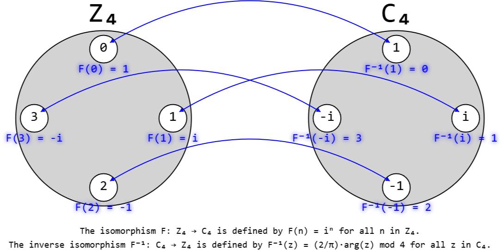

# Summary

Chalkboard is a library at the intersection of pure mathematics and web interactivity. It facilitates the construction and manipulation of computational structures and analytical systems in JavaScript and Node.js environments.

The library provides a comprehensive system of functionalities, including but not limited to defining isomorphisms between algebraic structures, computing the flux of vector fields over parameterized surfaces, simulating systems of differential equations, visualizing statistical regression models, simplifying and evaluating both real- and complex-valued expressions, executing multidimensional matrix operations, and automating Karnaugh map minimizations.

It enables the creation of exploratory computational lessons, browser-based visualizations, and self-study materials. Rather than treating mathematics in JavaScript as a thin layer of numerical utilities, Chalkboard provides explicit mathematical datatypes and operations that allow pedagogical applications on the web to mirror mathematical structure more directly.

# Statement of Need

Computationally-enabled educational infrastructure for mathematics increasingly takes place on the web in course websites, interactive demonstrations, and browser-based notebooks. However, educators and learners who intend to build such resources in raw JavaScript often face a gap between low-level numerical utilities and the richer mathematical abstractions needed for formal mathematical exposition.

Chalkboard addresses this gap by providing access to structured mathematical objects and computations in a way that can be integrated into educational materials on the web just as straightforwardly as one would write educational materials on paper. This lowers the friction between a mathematical idea and a programmed executable that students can inspect, manipulate, and learn from directly by opening a web URL, with no additional setup, installations, or runtime dependencies required.

The software may be adopted by others in several ways: instructors can embed Chalkboard-powered demonstrations into course websites; students can use examples as resources for autodidactic learning; and authors of educational content can use the library to build lessons that combine mathematics, programming, and visualization in a single web-oriented environment.

# Related Work

The JavaScript library ecosystem includes many mature mathematical libraries such as Math.js [@mathjs], Decimal.js [@decimaljs], and stdlib [@stdlibjs]. These projects are valuable tools for general-purpose computation, but they are not primarily oriented around establishing accessible, interactive, formal mathematics as a system of structures.

Chalkboard differs from them by emphasizing a comprehensive and coherent API designed for engagement with mathematics in a web browser that reflects engagement with mathematics on a paper. Its goal is not to replace specialized computer algebra systems or high-performance numerical environments, but to support educational workflows in which mathematical ideas, computation, and visualization are tightly integrated.

# Software Functionality

Chalkboard is organized into fifteen topic-oriented namespaces, totaling nearly seven hundred functions, with a consistent, intuitive call pattern of the form `Chalkboard.namespace.function(parameters);`. It also defines a set of eleven custom datatypes, including objects for complex numbers, matrices, vectors, tensors, quaternions, morphisms, ordinary differential equations, and algebraic structures.

This design is intended to make pedagogical programming more legible by categorizing operations according to mathematical topic rather than presenting them as an amalgamation of helper functions. To illustrate this ergonomic approach, consider how Chalkboard provides a declarative syntax that mirrors the style of writing mathematics on paper:

```js
// Define sets
const Z4 = Chalkboard.abal.Z(4);
const C4 = Chalkboard.abal.C(4);

// Define groups
const G = Chalkboard.abal.group(Z4, (m, n) => (m + n) % 4);
const H = Chalkboard.abal.group(C4, (z, w) => Chalkboard.comp.mul(z, w));

// Define isomorphism
const F = Chalkboard.abal.isomorphism(G, H, (n) => Chalkboard.I(n));
```

In the snippet above, Chalkboard defines a group isomorphism $F: G \to H$ between the additive group of integers modulo 4, $G = (\mathbb{Z}_4, +)$, and the multiplicative group of fourth roots of unity, $H = (\mathbb{C}_4, \times)$. Rather than treating these as mere arrays, the library represents them as custom `ChalkboardStructure` datatypes (recall that it has a total of eleven custom datatypes, facilitating the functions in various namespaces to be able to "understand" their mathematical contexts), which allow the `Chalkboard.abal` namespace to treat them as virtual algebraic structures, and thus robustly assess the group axioms for them. This enables the library to verify that the mapping $F(n) = i^n$ preserves the underlying structure, or in other words, to verify that the operation in the domain $G$ is perfectly mirrored by the operation in the codomain $H$.

The design of Chalkboard is useful in pedagogical settings because the code can serve simultaneously as an executable program and as a coherent representation of the mathematics itself.

# Educational Impact

Chalkboard significantly lowers the barrier to entry of creatively and educationally demonstrating mathematical beauty and curiosity on the web. Its [documentation](https://zushah.github.io/Chalkboard) includes a variety of [examples](https://zushah.github.io/Chalkboard/examples) to get started with: for physics, Chalkboard can simulate the [three-body problem](https://zushah.github.io/Chalkboard/examples/threebody.html) with a 12-dimensional ordinary differential equation and model [fluid flow](https://zushah.github.io/Chalkboard/examples/fluid.html) using particles moving along a vector field; it supports abstract algebra and number theory with thorough namespaces that allow visual demonstrations of [group isomorphisms](https://zushah.github.io/Chalkboard/examples/isomorphism.html) and [modular arithmetic symmetry](https://zushah.github.io/Chalkboard/examples/mandala.html); it is also highly capable in applied contexts, from rendering real-time statistical [telemetry dashboards](https://zushah.github.io/Chalkboard/examples/telemetry.html) to executing 3D rotations with both [matrices](https://zushah.github.io/Chalkboard/examples/matr-donut.html) and [quaternions](https://zushah.github.io/Chalkboard/examples/quat-donut.html); lastly, it can effectively exhibit classic explanatory graphics, such as the [Mandelbrot set](https://zushah.github.io/Chalkboard/examples/mandelbrot.html) from complex numbers and [Newton's method](https://zushah.github.io/Chalkboard/examples/newton.html) from calculus.



A recent addition is an experiment-oriented example which is an [ODE solver error vs step size study](https://zushah.github.io/Chalkboard/examples/ode-study.html) that compares multiple fixed-step ODE solvers across step counts, computes error metrics, estimates observed convergence order, generates plots, and exports results in machine-readable CSV/JSON formats. Therefore, Chalkboard can support not only visual demonstrations but also computational lessons in numerical analysis.

At present, Chalkboard has primarily been used to create self-contained interactive demonstrations rather than as a part of a formally deployed classroom platform. However, the software is explicitly designed for straightforward adoption because it runs natively in standard web environments without having any heavyweight runtime requirements.

# Availability

The source code for Chalkboard is openly available at its [repository on GitHub](https://www.github.com/Zushah/Chalkboard) under the [Mozilla Public License 2.0](https://www.mozilla.org/en-US/MPL/2.0/).

# Acknowledgements

The author would like to acknowledge the contributors who have helped develop Chalkboard. Specifically, thanks to GitHub users [\@bhavjitChauhan](https://www.github.com/bhavjitChauhan) for his contribution of adding partial pivoting to the matrix inversion function, [\@gyang0](https://www.github.com/gyang0) for his contributions to the documentation of the plotting and geometry namespaces, and [\@JentGent](https://www.github.com/JentGent) for his open-source implementation [@jentgent_linalg] of QR decomposition that was adapted into the matrix namespace.

# References
